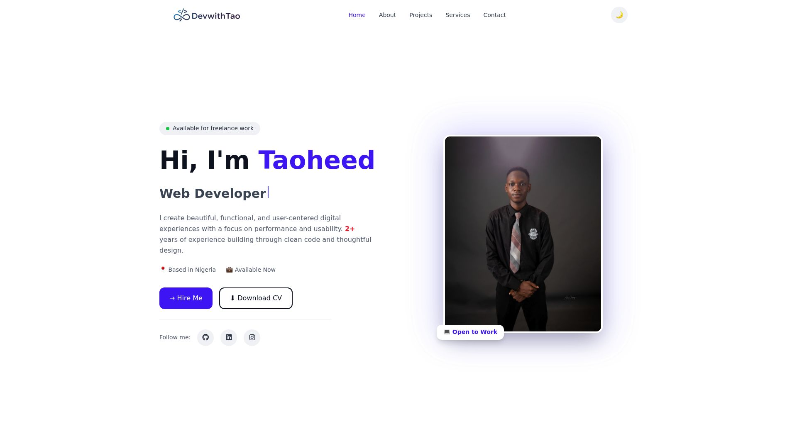
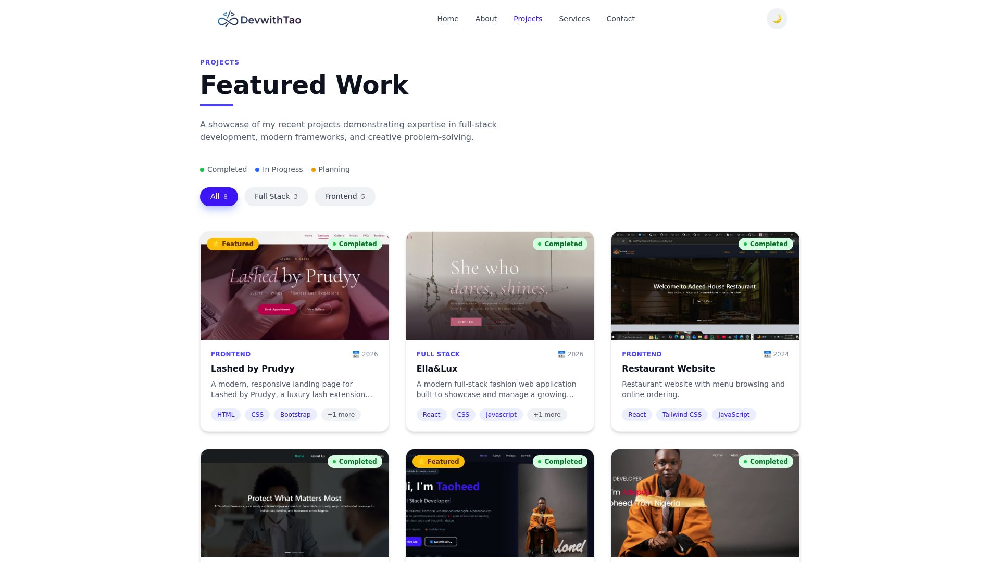
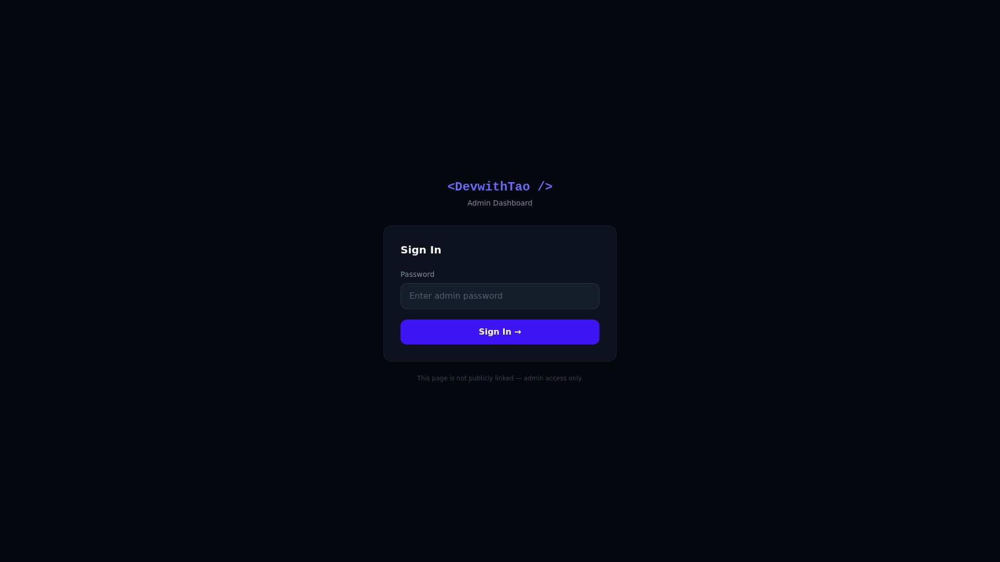

# 🚀 DevwithTao — Full Stack Portfolio


<div align="center">


**A premium full-stack developer portfolio with a live admin dashboard, MongoDB backend, and Cloudinary CV management.**

[🌐 Live Site](https://portfolio-v2-theta-one-81.vercel.app) · [🔐 Admin Panel](https://portfolio-v2-theta-one-81.vercel.app/admin/login) · [📧 Contact](mailto:adepojutaoheed23@gmail.com)

</div>

---

## 📸 Screenshots





---


## ✨ Features

| Feature | Description |
|---|---|
| 🎨 Premium UI | Glassmorphism navbar, Framer Motion page transitions |
| 🌙 Dark / Light Mode | Toggles instantly, persists across sessions |
| ⌨️ Typing Animation | Rotating developer titles on hero section |
| 📊 Skills Section | Categorized tabs with animated progress bars + Devicon icons |
| 🃏 Project Cards | Slide-up overlay with status badges and Live Demo links |
| 🔍 Project Filters | Filter by category (Frontend / Full Stack) with load more |
| 📧 Contact Form | EmailJS — sends real emails directly to inbox |
| 📄 Dynamic CV | Upload, replace or remove CV from admin dashboard |
| 🔐 Admin Dashboard | Password-protected — add, edit, delete, feature projects |
| 📱 Fully Responsive | Mobile, tablet, and desktop optimized |

---

## 🛠️ Tech Stack

### Frontend


### Backend


### Services & Hosting


---

## 📁 Project Structure

```
portfolio-v2/                   # Frontend — React + Vite
├── public/
│   ├── favicon.png
│   └── images/                 # Profile photos, project screenshots
├── src/
│   ├── admin/
│   │   ├── AdminDashboard.jsx  # Main admin UI
│   │   ├── AdminLogin.jsx      # Password-protected login
│   │   ├── ProjectFormModal.jsx# Add/edit project modal
│   │   └── ProtectedRoute.jsx  # Route guard
│   ├── animations/
│   │   └── variants.js         # Framer Motion configs
│   ├── components/
│   │   ├── Navbar.jsx          # Glassmorphism navbar
│   │   └── Footer.jsx
│   ├── context/
│   │   ├── AuthContext.jsx     # Admin auth state
│   │   ├── ProjectsContext.jsx # Projects state + API calls
│   │   └── ThemeContext.jsx    # Dark/light mode
│   ├── data/
│   │   └── projects.js         # Fallback static data
│   ├── pages/
│   │   ├── Home.jsx            # Hero, skills, featured projects
│   │   ├── About.jsx
│   │   ├── Projects.jsx        # Full projects grid
│   │   ├── Services.jsx
│   │   └── Contact.jsx         # EmailJS form
│   └── services/
│       └── api.js              # All backend API calls

server/                         # Backend — Node.js + Express
├── config/
│   └── cloudinary.js           # Cloudinary + Multer setup
├── middleware/
│   └── auth.js                 # Admin secret key guard
├── models/
│   ├── Project.js              # Mongoose project schema
│   └── Settings.js             # CV URL storage schema
├── routes/
│   ├── projects.js             # CRUD /api/projects
│   └── settings.js             # CV upload /api/settings
└── index.js                    # Express server entry
```

---

## 🚀 Getting Started

### Prerequisites
- Node.js 18+
- MongoDB Atlas account (free)
- Cloudinary account (free)
- EmailJS account (free)

### 1. Clone the repos

```bash
git clone https://github.com/tao544/portfolio-v2.git
git clone https://github.com/tao544/portfolio-backend.git
```

### 2. Setup Frontend

```bash
cd portfolio-v2
npm install
```

Create `.env` in `portfolio-v2/`:
```env
VITE_API_URL=http://localhost:5000
VITE_ADMIN_SECRET=your_admin_secret
VITE_ADMIN_PASSWORD=your_admin_password
```

```bash
npm run dev
```

### 3. Setup Backend

```bash
cd portfolio-backend
npm install
```

Create `.env` in `server/`:
```env
MONGODB_URI=your_mongodb_connection_string
ADMIN_SECRET=your_admin_secret
PORT=5000
CLOUDINARY_CLOUD_NAME=your_cloud_name
CLOUDINARY_API_KEY=your_api_key
CLOUDINARY_API_SECRET=your_api_secret
```

```bash
npm run dev
```

### 4. Seed the database (optional)

```bash
cd portfolio-backend
node seed.js
```

---

## 🌐 Deployment

| Service | Platform | Purpose |
|---|---|---|
| Frontend | Vercel | Auto-deploys from GitHub |
| Backend | Render | Auto-deploys from GitHub |
| Database | MongoDB Atlas | Cloud hosted |
| Files | Cloudinary | CV + media storage |

### Deploy Frontend (Vercel)
1. Push to GitHub
2. Import repo on [vercel.com](https://vercel.com)
3. Add environment variables in Vercel dashboard
4. Deploy ✅

### Deploy Backend (Render)
1. Push to GitHub
2. Create Web Service on [render.com](https://render.com)
3. Set build command: `npm install`
4. Set start command: `node index.js`
5. Add environment variables in Render dashboard
6. Deploy ✅

---

## 🔐 Admin Dashboard

The admin panel is not publicly linked — only accessible via direct URL:

```
https://your-portfolio.vercel.app/admin/login
```

**Admin capabilities:**
- ➕ Add new projects with full details
- ✏️ Edit existing projects
- 🗑️ Delete projects (with confirmation)
- ⭐ Toggle featured status
- 🔄 Change project status (Planning / In Progress / Completed)
- 📄 Upload / Replace / Remove CV via Cloudinary

---

## 📬 Contact

**Taoheed Adepoju** — Full Stack Developer based in Lagos, Nigeria 🇳🇬

[](mailto:adepojutaoheed23@gmail.com)
[](https://www.linkedin.com/in/taoheed-adepoju-72839122b)
[](https://github.com/tao544)
[](https://portfolio-v2-theta-one-81.vercel.app)

---

## 📄 License

This project is open source and available under the [MIT License](LICENSE).

---

<div align="center">

Built with ❤️ by **DevwithTao** · Lagos, Nigeria 🇳🇬

⭐ **Star this repo if you found it helpful!**

</div>
